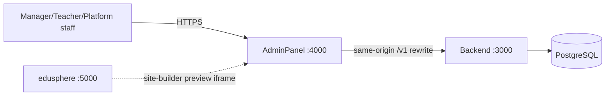
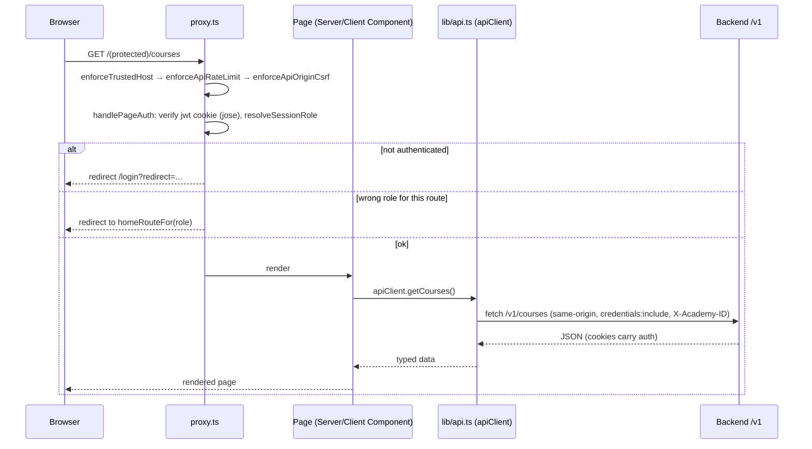
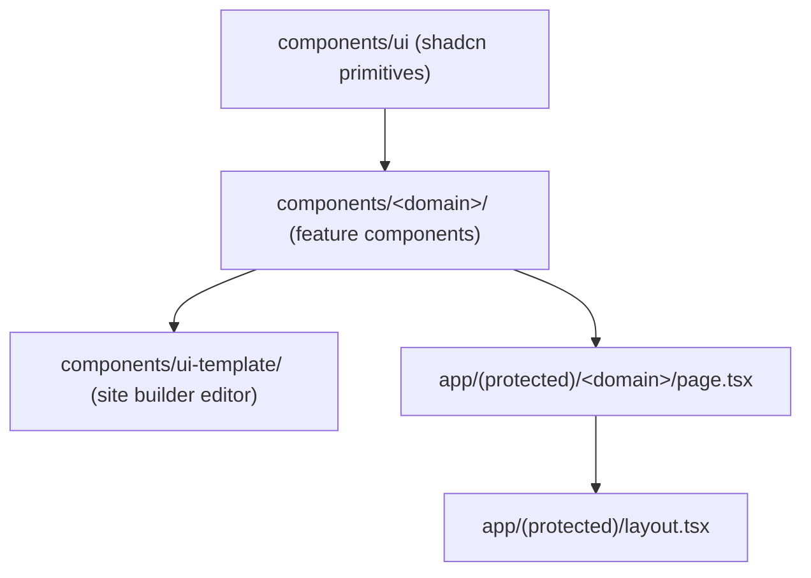
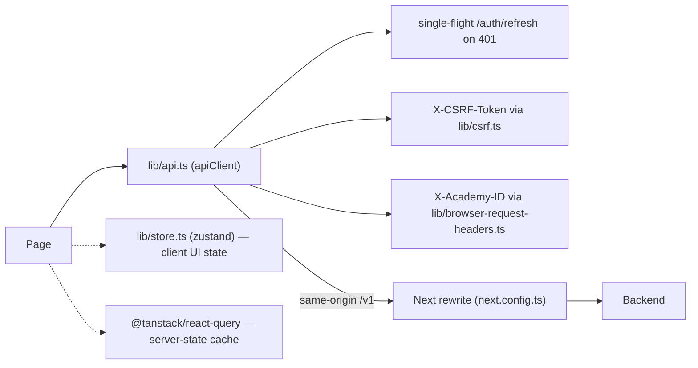
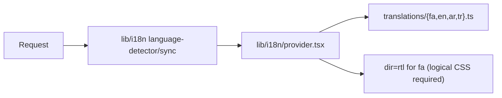

# Architecture — AdminPanel

Full business context: `docs/project-context.md`. This file is the technical map.

## System context

## Request flow: proxy.ts → page → API client → Backend

`proxy.ts` is UX routing only — the Backend's own guards are the real authorization boundary (see Backend's `ARCHITECTURE.md`).

## Component layering

## Data layer

Detail: `docs/frontend-data-layer.md`.

## i18n / RTL flow

## System design: exists / partial / planned

| Concern | Status | Where |
|---|---|---|
| Auth / session routing | Exists | `proxy.ts`, `lib/auth-routing.ts` |
| Same-origin API proxying | Exists | `next.config.ts` rewrites, `lib/api-base-url.ts` |
| Granular RBAC UI (hide by permission) | Partial | mirrors Backend's permission grid for the 7 controllers it covers; rest use role-only checks |
| Site builder / white-label editor | Exists | `components/ui-template/`, live preview into edusphere |
| i18n (fa/en/ar/tr) | Exists | `lib/i18n/` |
| Offline/PWA | Not built | not a current priority |
| Client-side error boundary reporting | Exists | Sentry (`sentry.*.config.ts`) |

## Owner map — update these docs when you touch these paths

| Change | Update |
|---|---|
| `proxy.ts` | Request-flow diagram above |
| `app/(protected)/<new-domain>/` (new route group) | Component layering + `ONBOARDING.md` folder map |
| `lib/api.ts` structure (or its split-up modules) | Data layer diagram |
| Auth/tenant handling (`lib/auth-routing.ts`, `lib/browser-request-headers.ts`) | Request-flow diagram |

Update `docs/ONBOARDING.md` too whenever a command, env var, or gotcha changes.
